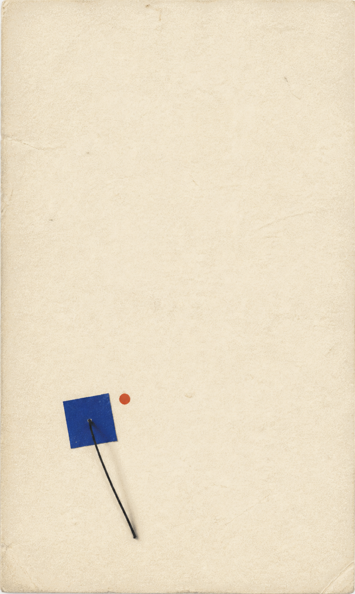
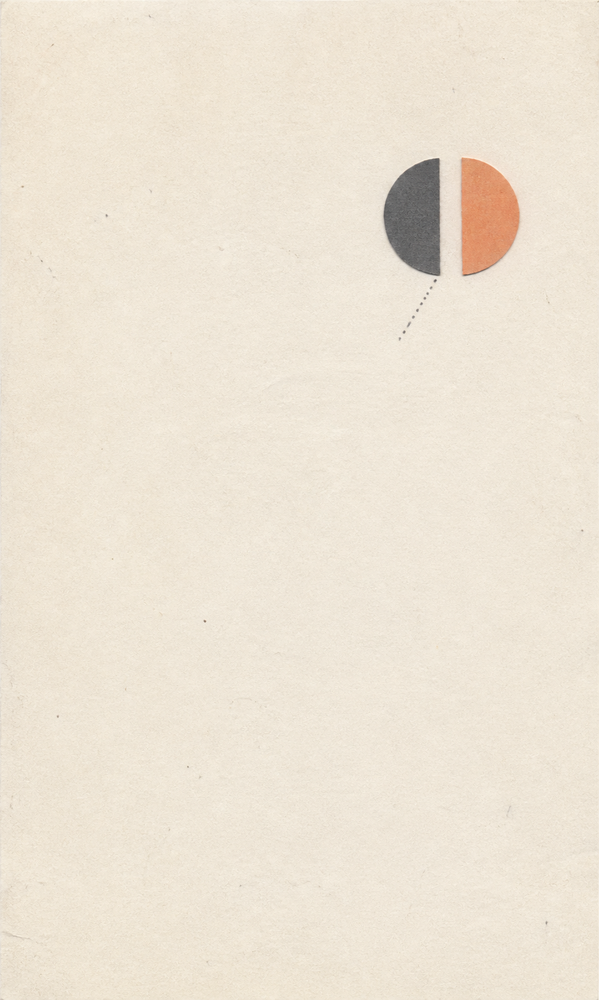
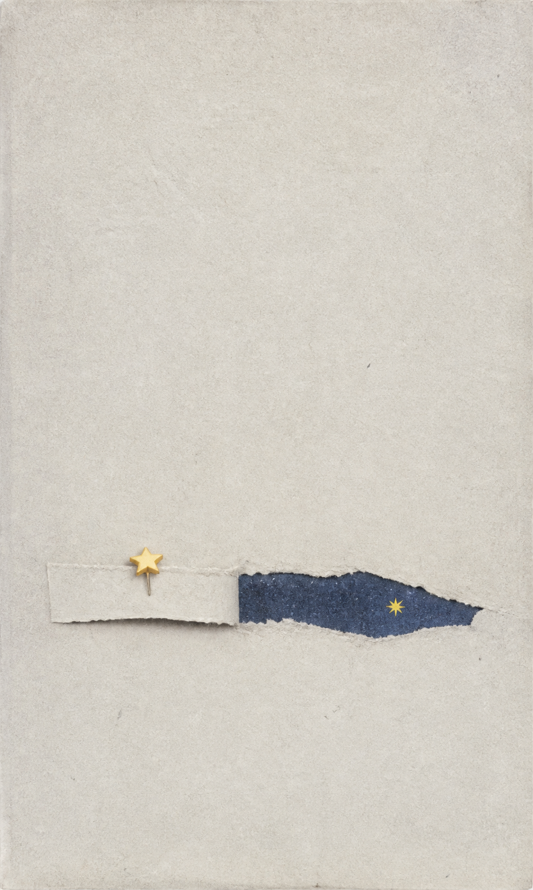
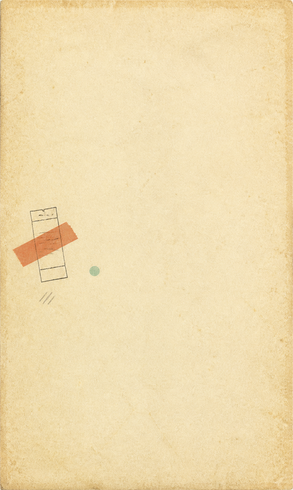
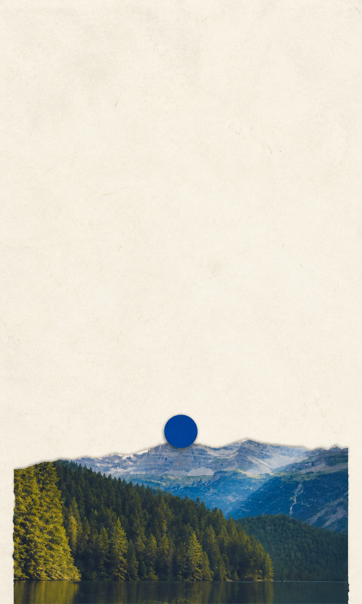

# 静默信号社 / Quiet Signal Press

> [中文](README.md) · [English](README.en.md)


将主题、短句、文章想法或照片变成一张高留白的纸张编辑海报：一处视觉信号，一种鲜明色彩，一大片安静的纸面。

> 不是给照片套滤镜，而是把内容压缩成一个可被看见的关系：接近但未相触、被遮住的线索、留下的痕迹。

## 目录

- [适合什么](#适合什么)
- [快速开始](#快速开始)
- [四种工作方式](#四种工作方式)
- [视觉合同](#视觉合同)
- [案例](#案例)
- [使用边界](#使用边界)
- [贡献](#贡献)
- [归属与许可证](#归属与许可证)

## 适合什么

- 文章封面、情绪卡、概念视觉、展览导视和摄影笔记。
- 直接生成海报、只返回可复制提示词，或分析一组参考图的视觉系统。

## 快速开始

1. 将 `quiet-signal-press` 复制到 `~/.codex/skills/`。
2. 上传图片或输入主题后说：

   ```text
   使用 $quiet-signal-press 做一张关于雨后书店的纸张编辑海报。
   ```

默认生成成品与最终提示词。明确说“只给提示词”时，Skill 才不会出图。

### 安装

```bash
git clone https://github.com/StarSure/quiet-signal-press.git
cp -R quiet-signal-press/quiet-signal-press ~/.codex/skills/
```

或只复制本仓库中的 `quiet-signal-press/` 文件夹即可。重启或重新打开 Codex 对话后，使用 `$quiet-signal-press` 调用。

## 四种工作方式

| 你提供的内容 | 建议说法 | 返回内容 |
| --- | --- | --- |
| 主题、情绪、短句 | `使用 $quiet-signal-press 做一张关于错过末班车的海报` | 成品 + 最终提示词 |
| 文章或笔记 | `把这段文字压缩成一张静默信号社海报` | 成品 + 关系解释 |
| 一张照片 | `用这张照片做静默信号社海报，保留人物和雨衣颜色` | 成品 + 保留说明 |
| 参考图 | `分析这组图的视觉系统，再生成一张新的` | 规则拆解 + 新成品 |

只需提示词时，明确写：`使用 $quiet-signal-press，只给我提示词，不出图。`

## 视觉合同

| 项目 | 默认规则 |
| --- | --- |
| 画布 | 3:5 竖版 |
| 留白 | 72–88% 为开放纸面 |
| 主体 | 一个紧凑视觉信号，占 7–20% |
| 色彩 | 一种清晰高饱和强调色 |
| 材料 | 纤维纸、干墨、扫描颗粒、印刷误差 |

完整的视觉系统、提示词与验收标准在 [Skill 目录](quiet-signal-press/) 中。

## 案例

以下案例均为本项目原创生成，刻意不用文字，方便展示“一个信号、一种关系”的骨架。完整输入和制作笔记见 [examples/README.md](examples/README.md)。

| 关系 | 成品 | 采用的手法 |
| --- | --- | --- |
| 穿过 |  | `Interrupted pair`：缝线让一个小纸片产生阻力 |
| 未相触 |  | `Margin specimen`：用微小间隔代替叙事 |
| 被揭开的夜色 |  | `Clipping window`：仅露出一个窄小窗口 |
| 被归档的碎片 |  | `Index trace`：像资料袋里留下的标记 |

### Licowa 风景输入案例

下列两张把 Licowa 壁纸作为输入，保留景物辨识度、但将摄影缩小为纸张拼贴中的一个视觉信号。它们是最贴近实际“上传照片后生成”的用法。

| Licowa 输入 | 海报输出 | 保留与改写 |
| --- | --- | --- |
| [Alpine Mountain Lake](https://licowa.com/wallpaper/detail/alpine-mountain-lake-forest-4k-wallpaper-413965) |  | 山脊、松林、湖面被保留；摄影被压缩至底部窗口 |
| [Mount Cook Road Nature](https://licowa.com/wallpaper/detail/mount-cook-road-nature-landscape-4k-wallpaper-413959) |  | 道路与雪山被保留；红色撕纸成为“路线受阻”的关系 |

前四张抽象图可随仓库按 MIT 使用。Licowa 源图不随仓库分发；这两张衍生案例仅用于展示与推广 Licowa，权利说明见 [examples/LICOWA_SOURCES.md](examples/LICOWA_SOURCES.md)。若要把它们用于仓库以外，请先向 Licowa 确认权利。

## 使用边界

这不是广告模板、全景摄影排版、品牌 Logo 设计或精确文字排版工具。参考图只用于提炼视觉规律，不复制其文字、品牌、签名、水印或精确构图。

## 贡献

欢迎提交新的、无文字的案例，或补充不同输入类型的验收样本。请先阅读 [CONTRIBUTING.md](CONTRIBUTING.md)：提交物必须有可再分发权利，且不能把参考图中的品牌和文字带入成品。

## 归属与许可证

本项目以 MIT 发布。它是对 [gc-minimal-zine-poster](https://github.com/LiamGvchi/gc-minimal-zine-poster) 的独立重写型等效衍生项目；保留的上游 MIT 归属见 [UPSTREAM_NOTICE.md](UPSTREAM_NOTICE.md)。
